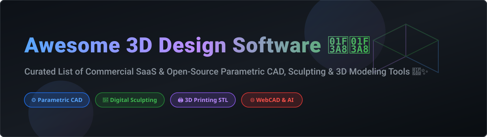
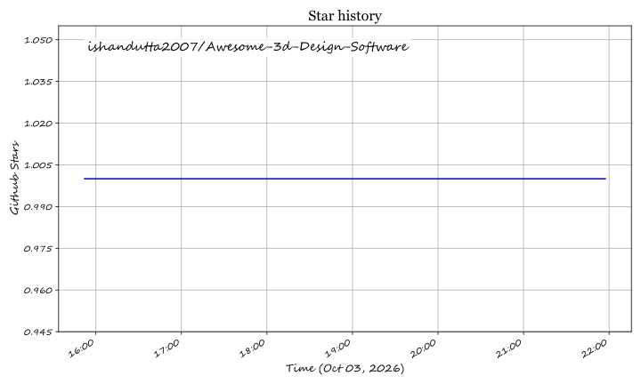

# Awesome 3D Design Software 🎨✨

  
  
  
  
  

## 🚀 Top 3D Design Software & CAD Ecosystem 🛠️

**Curated List of Commercial SaaS Platforms & Open-Source GitHub Projects**  
*Focused on Parametric CAD, Organic Modeling, 3D Printing STL, Digital Sculpting, and WebCAD*  

**Last updated: October 2026** 📅

---

### 🔍 Overview & Market Intelligence 📊

This repository tracks notable **commercial SaaS platforms** and production-ready **open-source GitHub projects** for **3D Design**, **Parametric CAD**, and **3D Printing**. Whether you are a mechanical engineer, game developer, architect, industrial designer, or maker creating precise mechanical parts, organic character sculptures, or watertight printable STL/STEP models, this guide provides structured market insight and tooling choices.

**Market Size & Sector Dynamics**: The global 3D design and CAD software market is estimated at **~$11.8 Billion** and is projected to expand significantly driven by additive manufacturing, industrial automation, and browser-native Web Assembly (WASM) CAD engines. The commercial sector is **highly concentrated** (dominated by multi-billion dollar tech giants like Autodesk, Trimble, Dassault Systèmes, and Maxon), while the open-source sector features mature, community-backed category leaders like Blender and FreeCAD alongside rising AI-powered WebCAD engines.

---

## 📑 Table of Contents
- [🏢 Commercial & SaaS Platforms](#-commercial--saas-platforms)
- [🔓 Open-Source GitHub Projects](#-open-source-github-projects)
- [🤝 How to Contribute](#-how-to-contribute)
- [⚠️ Disclaimer](#%EF%B8%8F-disclaimer)
- [☕ Support & Sponsorship](#-support--sponsorship)
- [📈 Star History](#-star-history)

---

## 🏢 Commercial & SaaS Platforms

The 3D design software market features well-established commercial platforms tailored for professional engineering, motion graphics, and industrial prototyping. Below is a structured analysis sorted by company size/valuation (descending).

| SaaS Product 🛠️ | Company Size / Valuation / Revenue 💰 | Pricing (Starting Tier) 💵 | Free Tier / Trial Limits ⏳ | Description & Key Features 📝 |
| :--- | :--- | :--- | :--- | :--- |
| **[Microsoft Paint 3D](https://www.microsoft.com/en-us/p/paint-3d/9nblggh5fv99)** | **$3.1 Trillion** (Market Cap) | **Free** (Built into Windows) | **Fully Free** (Discontinued Nov 2024; existing installs remain active) | **Discontinued 3D Editor.** Simplified tool for lightweight 3D object creation and 2D/3D composite editing. |
| **[Autodesk Fusion 360](https://www.autodesk.com/products/fusion-360/)** | **$54 Billion** (Market Cap) | **$85 / month** (or $680 / year) | **1-Year Renewable Free Personal License** (Limited to 10 active editable projects, basic CAM & 2D drawings) | **Leading Parametric CAD & CAM.** Cloud-powered parametric mechanical design, feature history, simulation, and generative design. |
| **[3ds Max](https://www.autodesk.com/products/3ds-max/)** | **$54 Billion** (Market Cap) | **$235 / month** (or $1,875 / year) | **30-Day Free Trial** (Full functional access for 30 days) | **Industry Standard 3D Animation & Rendering.** Powerful polygonal modeling and visual effects engine for games and architectural visualization. |
| **[Autodesk Tinkercad](https://www.tinkercad.com/)** | **$54 Billion** (Market Cap) | **Free** ($0 / month) | **100% Free Forever** (Unlimited designs, requires free Autodesk account) | **Beginner-Friendly CSG Modeler.** Browser-native solid block modeler ideal for quick 3D printing STL/OBJ exports and K-12 STEM education. |
| **[SketchUp](https://www.sketchup.com/)** | **$15 Billion** (Market Cap - Trimble) | **$119 / year** (SketchUp Go) | **SketchUp Free** (Web-only version with 10 GB Trimble Connect cloud storage limits) | **Architectural & Push-Pull Modeler.** Fast conceptual surface modeling popular in architecture, interior design, and woodworking. |
| **[Cinema 4D](https://www.maxon.net/en/cinema-4d)** | **$1.8 Billion** (Parent Nemetschek Market Cap) | **$99 / month** (or $719 / year) | **14-Day Free Trial** (Full access via Maxon App for 14 days) | **Motion Graphics & 3D Sculpting Suite.** Renowned for procedural animation, MoGraph tools, and seamless visual effects pipelines. |
| **[ZBrush](https://www.maxon.net/en/zbrush)** | **$1.8 Billion** (Parent Nemetschek Market Cap) | **$39 / month** (or $359 / year) | **14-Day Free Trial** (Full ZBrush digital sculpting access for 14 days) | **World Leading Digital Sculpting.** High-density organic sculpt modeling for film, AAA games, jewelry, and collectible miniatures. |
| **[Rhino 3D](https://www.rhino3d.com/)** | **~$200 Million** (Privately Held Revenue/Valuation) | **$995** (Commercial Commercial Perpetual License) | **90-Day Free Trial** (100% fully functional for 90 days; saves disable after 90 days) | **NURBS & Industrial Surface Design.** Industrial-grade freeform NURBS modeling engine with Grasshopper visual scripting for parametric architecture. |
| **[Vectary](https://www.vectary.com/)** | **~$25 Million** (Venture Backed) | **$19 / month** (Pro Plan) | **Free Plan** (Up to 10 workspace projects and 1,000 views/month limit) | **Browser-Native 3D & AR Workspace.** Real-time collaborative 3D web configurator and interactive AR publishing platform. |

---

## 🔓 Open-Source GitHub Projects

The open-source 3D design ecosystem is exceptionally mature and production-proven, spanning parametric mechanical CAD engines, digital sculpting, and code-driven geometry generators. 

Projects below are sorted by GitHub Stars_Count (descending).

| Project & Repo Link 📦 | GitHub_Stars ⭐ | License 📜 | Ecosystem Category 🏷️ | Description & Highlights ⚡ |
| :--- | :--- | :--- | :--- | :--- |
| **[FreeCAD](https://github.com/FreeCAD/FreeCAD)** |  | LGPL-2.1 | Parametric CAD | **Premier Open-Source Parametric Modeler.** Feature-based history tree, constraint 2D Sketcher, FEM simulation, CAM/CNC workbenches, and BIM support. |
| **[Blender](https://github.com/blender/blender)** |  | GPL-3.0 | Organic Sculpting & 3D Suite | **Industry Standard Open-Source 3D Suite.** Professional polygon modeling, digital sculpting, Cycles/Eevee photorealistic rendering, VFX, and animation. |
| **[OpenSCAD](https://github.com/openscad/openscad)** |  | GPL-2.0 | Code-First CSG CAD | **The Programmers' Solid 3D CAD Modeler.** Text-scripted constructive solid geometry (CSG), 100% version-controllable plain text designs, ideal for parametric 3D printing. |
| **[LibreCAD](https://github.com/LibreCAD/LibreCAD)** |  | GPL-2.0 | 2D Technical Drafting | **Comprehensive 2D CAD System.** Open-source 2D drafting and technical drawing platform supporting DXF formats. |
| **[SolveSpace](https://github.com/solvespace/solvespace)** |  | GPL-3.0 | Lightweight Parametric CAD | **Ultra-Fast Parametric 3D CAD.** Lightweight standalone 2D/3D constraint solver, assembly animator, and STEP/STL exporter. |
| **[Hew](https://github.com/hew3d/hew)** |  | Open-Source | Watertight Solid Push-Pull | **Solids-First SketchUp Alternative.** Intuitive push/pull workflow rebuilt in Rust & WASM on watertight solid geometry, exporting glTF/STL/3MF. |
| **[Kerf](https://github.com/kerf-sh/kerf)** |  | MIT | AI-Powered Multi-Domain CAD | **All-in-One Local-First CAD System.** Integrates OpenCascade B-Rep, JSCAD, 2D sketcher, electronics, FEM/CFD, and LLM-driven diff editing across 37 engineering domains. |

---

### 🛠️ Categorized Quick Reference

- **Parametric CAD & Engineering**: [FreeCAD](https://github.com/FreeCAD/FreeCAD) (LGPL), [OpenSCAD](https://github.com/openscad/openscad) (GPL), [SolveSpace](https://github.com/solvespace/solvespace) (GPL), [Hew](https://github.com/hew3d/hew), [Kerf](https://github.com/kerf-sh/kerf) (MIT).
- **Organic Sculpting & Visualization**: [Blender](https://github.com/blender/blender) (GPL).
- **2D Technical Drafting**: [LibreCAD](https://github.com/LibreCAD/LibreCAD) (GPL).

---

## 🤝 How to Contribute

Contributions are welcome! Please follow these steps to add new commercial or open-source tools:

1. Fork this repository.
2. Update `README.md` following the exact table structure above.
3. Ensure pricing detail, free tier limits, and accurate GitHub star metrics are provided.
4. Submit a Pull Request with a clear description of your addition.

Refer to the main awesome list collection at [Awesome-Awesome-Awesome](https://github.com/ishandutta2007/Awesome-Awesome-Awesome).

---

## ⚠️ Disclaimer

- This is a community-curated list intended for informational purposes.
- Product logos, trademarks, and company valuations are property of their respective owners.
- Open-source licenses should be verified directly within individual GitHub repositories.

---

## ☕ Support & Sponsorship

If you find this curated 3D design software registry useful, consider supporting the maintenance and continuous updates! 

🌟 **Star** this repository to show your support!  
🍴 **Fork** it to keep a personal backup or contribute back!  
📢 **Share** it with your fellow engineers, artists, and makers!  

💖 **Sponsor directly**: You can buy me a coffee and sponsor ongoing open-source curation via the [GitHub Sponsor Dashboard](https://github.com/sponsors/ishandutta2007).

---

## 📈 Star History

---

Made with ❤️ for engineers, artists, makers, and 3D printing enthusiasts worldwide.

## ⭐ Star History

<a href="https://star-history.com/#ishandutta2007/Awesome-3d-Design-Software&Timeline" align="center">
  <picture>
    <source media="(prefers-color-scheme: dark)" srcset="assets/ishandutta2007_Awesome-3d-Design-Software_growth.svg">
    
  </picture>
</a>
